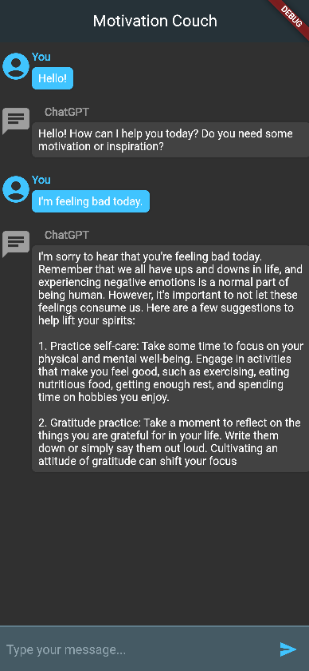

# Motivation Coach

Motivation Coach is a Flutter application that leverages the power of OpenAI's ChatGPT to act as a motivational coach. Whether you need a boost of motivation, some words of encouragement, or just someone (or something) to talk to, Motivation Coach is here for you.

## Features

- **Interactive Chat**: Engage in a conversation with ChatGPT.
- **Dark Mode**: A sleek, modern dark-themed UI.
- **Responsive**: Works seamlessly on both mobile and web.

## Getting Started

1. **Clone the Repository**:
git clone https://github.com/AviadKa/motivation_coach.git
cd motivation_coach

2. **Update the OpenAI API Key**:
Before you can interact with OpenAI's ChatGPT, you need to update the `_apiKey` inside `openai_service.dart` with your own OpenAI API key.

3. **Install Dependencies**:
flutter pub get
4. **Run the App**:
flutter run

## How It Was Built

This application was built with the help of OpenAI's ChatGPT. The entire development process, from ideation to implementation, was documented in a conversation with ChatGPT. You can find the detailed conversation [here](https://chat.openai.com/share/f69d4023-fd39-456f-845e-bb04e3b0b302).

## Dependencies

- [Flutter](https://flutter.dev/)
- [OpenAI](https://www.openai.com/)

## Contributing

Pull requests are welcome. For major changes, please open an issue first to discuss what you would like to change.

## License

[MIT](https://choosealicense.com/licenses/mit/)

